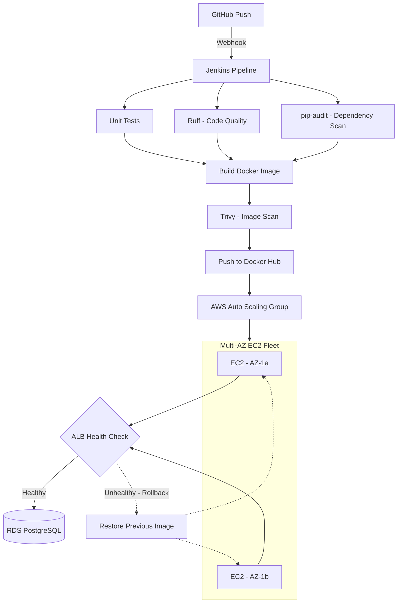

# TaskBoard - AWS CI/CD Project

TaskBoard is a simple Flask REST API I built to put together a real, end-to-end DevOps workflow that actually tests, scans, builds, deploys, and heals itself the way a production setup would.

The pipeline runs unit tests, checks code quality, scans for vulnerable dependencies, builds and scans a Docker image, then rolls the new version out across a fleet of EC2 instances behind a load balancer — one instance at a time, with health checks at every step and automatic rollback if something goes wrong.

## Architecture



*Rendered natively by GitHub — no image file needed, and it stays readable when the pipeline changes. The dashed path shows what happens when a deploy fails its health check: Jenkins restores the last known-good image on that instance and re-registers it with the ALB.*

## Tech Stack

- **App:** Python, Flask, PostgreSQL
- **CI/CD:** Jenkins, GitHub, GitHub webhooks, Docker Hub
- **AWS:** EC2, Auto Scaling Groups, Application Load Balancer, RDS, IAM, Security Groups
- **Quality & Security:** pytest, Ruff, pip-audit, Trivy

## How the Pipeline Works

A push to GitHub fires a webhook that kicks off the Jenkins pipeline. From there:

1. Checkout the source code
2. Spin up a Python virtual environment
3. Install dependencies
4. Run unit tests and generate coverage
5. Run Ruff for code quality
6. Run pip-audit to catch vulnerable dependencies
7. Build the Docker image
8. Scan the freshly built image with Trivy, before it goes anywhere near Docker Hub
9. Push the image to Docker Hub
10. Discover the currently active EC2 instances in the Auto Scaling Group
11. Roll the new version out instance by instance
12. Run an application-level health check on each instance
13. Register the instance back with the ALB and wait for it to report healthy
14. Move to the next instance
15. If a health check fails at any point, roll back to the previous image automatically

## Rolling Deployment

I didn't want a deploy that just replaces everything at once and hopes for the best, so each instance goes through its own mini-lifecycle during a release:

1. Deregister the instance from the ALB
2. Let existing connections drain
3. Note the current image, so there's something to fall back to
4. Pull the new image from Docker Hub
5. Stop the old container, start the new one
6. Hit `/health` directly on the instance
7. If it's healthy, register it back with the ALB
8. Wait for the ALB itself to confirm the target is healthy
9. Move on to the next instance

If the new version fails its health check, Jenkins puts the previous image back and re-registers the instance — so a bad deploy doesn't take down a working instance along with it.

## Health Checks

The app exposes:

```
GET /health
```

```json
{
  "status": "ok"
}
```

There are two layers of checking here, on purpose:

- **Application health check** — Jenkins hits `http://localhost:5000/health` directly on the instance, before it's allowed to serve any real traffic.
- **ALB health check** — only after the app passes its own check does Jenkins register the instance with the load balancer, then waits for the ALB to independently confirm it's healthy.

That gap between the two is deliberate — it stops a technically-running-but-broken app from ever reaching production traffic.

## Database

I started with SQLite locally just to get moving fast, but production runs on PostgreSQL via Amazon RDS. Both application instances point at the same RDS database, so data stays consistent across the fleet. Credentials are injected through Jenkins Credentials — nothing sensitive is sitting in the repo.

## Docker Images

Every image is tagged with the Jenkins build number instead of relying on `latest`:

```
rishinraj/taskboard:48
```

That way a deployment always points at a specific, immutable build — no ambiguity about what's actually running.

## Security Scanning

Two checks run on every pipeline execution:

- **pip-audit** — scans Python dependencies for known CVEs.
- **Trivy** — scans the built Docker image for OS and application-level vulnerabilities, right after the image is built and before it's pushed anywhere.

The pipeline is configured to fail the build if either tool finds something above the configured severity threshold — so a vulnerable image never makes it to Docker Hub in the first place.

## Infrastructure

The app runs on EC2 instances inside an Auto Scaling Group, spread across multiple Availability Zones and registered with an Application Load Balancer. The ALB only ever sends traffic to targets it considers healthy. RDS PostgreSQL handles persistent, shared storage behind all of it.

## AWS / IAM

Jenkins talks to AWS through an IAM role, using the AWS APIs to:

- Discover instances in the Auto Scaling Group
- Look up EC2 private IPs
- Register and deregister targets with the ALB
- Check ALB target health
- Manage Auto Scaling Group capacity

## Repository Structure

```
taskboard/
|
├── app.py
├── requirements.txt
├── requirements-dev.txt
├── Dockerfile
├── Jenkinsfile
├── .trivyignore
├── tests/
│   └── test_app.py
├── .gitignore
└── README.md
```

## Running Locally

```bash
git clone <repository-url>
cd taskboard

python3 -m venv .venv
source .venv/bin/activate

pip install -r requirements.txt
python app.py
```

The app will be running at `http://localhost:5000`.

## API Endpoints

| Method | Endpoint | Description |
|--------|----------|-------------|
| GET | /health | Application health check |
| GET | /tasks | List tasks |
| POST | /tasks | Create a task |
| GET | /tasks/<id> | Get a task |
| PUT | /tasks/<id> | Update a task |
| DELETE | /tasks/<id> | Delete a task |

## What This Project Demonstrates

This project was my way of getting hands-on with a full DevOps loop rather than learning each piece in isolation:

- CI/CD pipeline design and Jenkins automation
- GitHub webhook-triggered builds
- Docker image creation and versioning
- Automated testing, code quality, and dependency/vulnerability scanning
- IAM, EC2, Auto Scaling Groups, and multi-AZ deployment
- Application Load Balancing and PostgreSQL on RDS
- Rolling deployments with real rollback logic
- Application and infrastructure-level health checks
- Secret management through Jenkins Credentials
- Thinking about high availability and fault tolerance, not just "does it run"

## Where I'd Take This Next

- HTTPS via AWS Certificate Manager
- CloudWatch monitoring and alarms
- Private application subnets + NAT Gateway
- Infrastructure provisioning with Terraform
- Configuration management with Ansible
- Blue/green deployments
- Automated infrastructure testing
